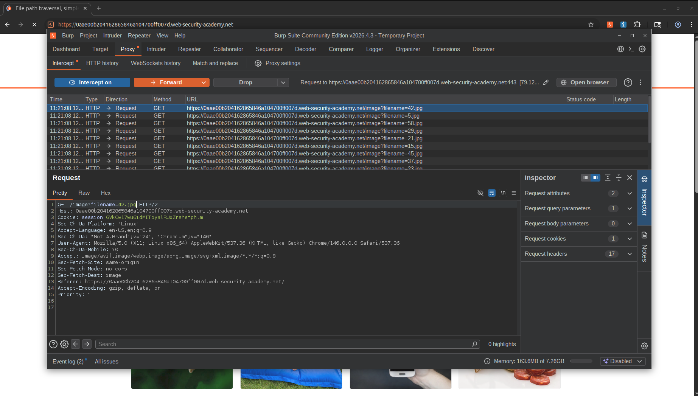
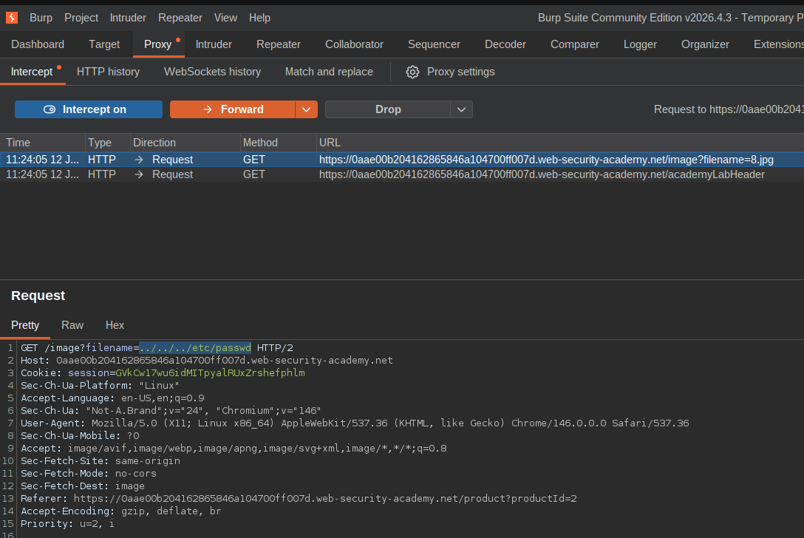

Lab: File path traversal, simple case

 This lab contains a path traversal vulnerability in the display of product images.

To solve the lab, retrieve the contents of the /etc/passwd file. 

Solution:
1.Use Burp Suite to intercept and modify a request that fetches a product image.

2.Modify the filename parameter, giving it the value:
../../../etc/passwd

3.Observe that the response contains the contents of the /etc/passwd file. 

Solution in My words/My Methodology:

1.Access the lab in the burp browser

2.Click on a product and intercept the traffic in burp proxy

3.Change the image file name to ../../../etc/passwd and send the request 

4.After the the response the lab is solved automatically

