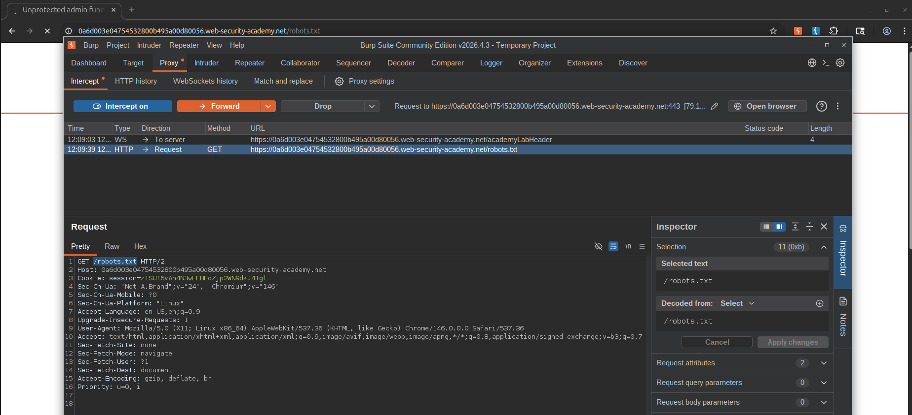
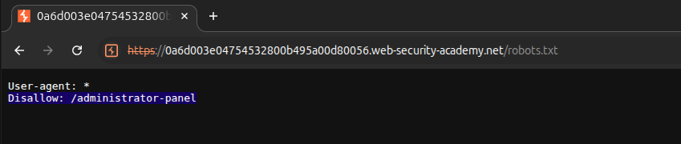
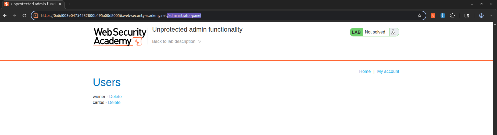
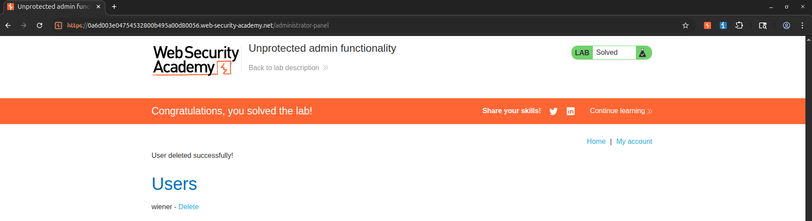

Lab: Unprotected admin functionality

 This lab has an unprotected admin panel.

Solve the lab by deleting the user carlos. 

Solution:
1.Go to the lab and view robots.txt by appending /robots.txt to the lab URL. Notice that the Disallow line discloses the path to the admin panel.

2.In the URL bar, replace /robots.txt with /administrator-panel to load the admin panel.

3.Delete carlos. 

My Methodology/My solution Explaination:
1.Access the lab in burp proxy browser

2.append /robots.txt in the end of the url and see it in burp suite and forward it

3.we can see the Disallow: /administrator-panel(hence we can conclude that going to this url gives us admin access)

4.instead of /robots.txt append /administrator-panel and we get the admin access

5.delete carlos user and the lab is solved successfully

